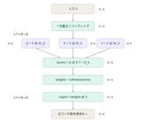
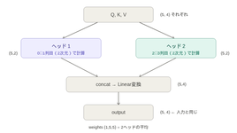
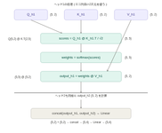

# Day 10：Transformerの全体構造

## 今日やったこと
- Transformerの全体構造を理解
- 位置エンコーディングの仕組みを実装
- Multi-Head Attentionを実装・可視化
- BERT・GPTとTransformerの関係を理解

---

## TransformerとBERT・GPTの関係

```
Transformer = エンコーダ + デコーダ（翻訳などに使う）

BERT：エンコーダのみ → 文章を理解することに特化（分類タスクが得意）
GPT ：デコーダのみ  → 文章を生成することに特化（次のトークン予測）
```

---

## Transformerブロックの構造

```
入力
  ↓
位置エンコーディング（単語の順番情報を付加）
  ↓
Multi-Head Attention（複数の視点で文脈を捉える）
  ↓
Add & Norm（残差接続 + 層正規化）
  ↓
Feed Forward Network（各単語の特徴を変換）
  ↓
Add & Norm
  ↓
出力
```

---

## 全体のフロー（形の変化）



```python
# 入力
X = torch.randn(5, 4)        # (5, 4) ← 5単語・4次元

# 位置エンコーディング
PE = positional_encoding(5, 4)
X_with_pos = X + PE          # (5, 4) ← 形は変わらない

# Q・K・V に変換
Q = X @ W_Q                  # (5, 4)
K = X @ W_K                  # (5, 4)
V = X @ W_V                  # (5, 4)

# Attentionスコア計算
scores = Q @ K.T / √d_k      # (5, 5) ← 単語数×単語数
weights = softmax(scores)    # (5, 5)

# 出力
output = weights @ V         # (5, 4) ← 入力と同じ形に戻る
```

---

## 位置エンコーディング

Attentionには「単語の順番」という概念がないので位置情報を付加する。

```python
def positional_encoding(seq_len, d_model):
    PE = torch.zeros(seq_len, d_model)
    position = torch.arange(0, seq_len).unsqueeze(1).float()
    div_term = torch.exp(
        torch.arange(0, d_model, 2).float() * (-np.log(10000.0) / d_model)
    )
    PE[:, 0::2] = torch.sin(position * div_term)  # 偶数列にsin
    PE[:, 1::2] = torch.cos(position * div_term)  # 奇数列にcos
    return PE
```

実際の出力（5単語・4次元の場合）：

```
      0列(sin) 1列(cos) 2列(sin) 3列(cos)
0番目：0.000    1.000    0.000    1.000   ← 全部基準値
1番目：0.841    0.540    0.010    1.000   ← 速い振動・遅い振動
2番目：0.909   -0.416    0.020    1.000
3番目：0.141   -0.990    0.030    1.000
4番目：-0.757  -0.654    0.040    0.999
```

### なぜsin/cosを使うのか
```
① 値が-1〜1に収まる（単語ベクトルと足し合わせやすい）
② 0・1列目：速く振動（位置の細かい区別）
   2・3列目：ゆっくり振動（位置の大まかな区別）
   → 各位置が一意のパターンになる
```

### なぜ加算で足し合わせるのか
```
加算：(5, 4) + (5, 4) → (5, 4)  ← 次元数そのまま・計算量が増えない
結合：(5, 4) + (5, 4) → (5, 8)  ← 次元数が倍になる
```

### div_termの計算の流れ
```python
step     = torch.arange(0, d_model, 2)   # [0, 2]（偶数インデックス）
scale    = -np.log(10000.0) / d_model    # スケール係数
exponent = step * scale                   # [0, -4.605...]
div_term = torch.exp(exponent)            # [1.0, 0.01]
# → 0列目は速い振動(1.0)、2列目は遅い振動(0.01)
```

---

## Multi-Head Attention



Day 9のAttentionを「複数の視点から同時に行う」仕組み。

```python
mha = nn.MultiheadAttention(
    embed_dim=4,    # 単語ベクトルの次元数
    num_heads=2,    # ヘッド数（embed_dimの約数）
    batch_first=True
)
output, weights = mha(X, X, X)  # Q=K=V=X（Self-Attention）
```

### 形の変化まとめ
```
入力X        (1, 5, 4)  ← バッチ込み
Q, K, V      (5, 4)    それぞれ
scores       (5, 5)    ← 単語数×単語数（次元数と無関係）
weights      (1, 5, 5) ← 2ヘッドの平均
output       (1, 5, 4) ← 入力と同じ形
```

### ヘッドの分割



```
embed_dim=4, num_heads=2 の場合

Head 1：0〜1列目（2次元）でAttentionを計算 → output_h1 (5, 2)
Head 2：2〜3列目（2次元）でAttentionを計算 → output_h2 (5, 2)
concat(output_h1, output_h2) → (5, 4) → Linear変換 → (5, 4)
```

各ヘッド内の処理はDay 9のAttentionと全く同じ。次元数が2になるだけ。

```
Head 1：Q(5,2) @ K.T(2,5) → scores(5,5) → weights(5,5) @ V(5,2) → (5,2)
Head 2：Q(5,2) @ K.T(2,5) → scores(5,5) → weights(5,5) @ V(5,2) → (5,2)
```

各ヘッドが異なるW_Q・W_K・W_Vを持つ → 異なる関係を同時に学習できる。

### Self-Attention vs Cross-Attention
```
Self-Attention  ：mha(X, X, X)  Q=K=V=X → 文章が自分自身に注目（BERTで使う）
Cross-Attention ：mha(Q, K, V)  Q≠K=V   → 別の文章に注目（翻訳のデコーダで使う）
```

### Attentionの重みの実際の出力
```python
# 「私が犬を好き」の5単語でランダムな重みで計算した結果
tensor([[[0.233, 0.168, 0.217, 0.201, 0.181],  # 私
         [0.135, 0.229, 0.167, 0.209, 0.260],  # が
         [0.271, 0.188, 0.199, 0.165, 0.177],  # 犬
         [0.364, 0.167, 0.173, 0.111, 0.185],  # を
         [0.136, 0.248, 0.171, 0.221, 0.224]]]) # 好き
# 学習済みBERTでやると意味的なパターンが出てくる
```

---

## Add & Norm（残差接続 + 層正規化）

```
output = LayerNorm(x + Attention(x))
                   ↑
              残差接続（元の入力をそのまま足す）
```

### 残差接続のイメージ
```
普通のネットワーク：
入力 → 変換 → 出力
         ↑
    うまく学習できないと情報が失われる

残差接続：
入力 → 変換 → + → 出力
  ↓____________↑
  元の入力をそのまま足す
  → 変換がうまくいかなくても元の入力は必ず残る（安全網）
  → 勾配消失が起きにくくなる
```

### 層正規化
各層の出力の値が大きくなりすぎたり小さくなりすぎたりしないように揃える処理。学習が安定する。

---

## Feed Forward Network（FFN）

Attentionの後に各単語独立に適用される2層のニューラルネット。

```
Attention：「どの単語と関係があるか」を捉える（単語間の関係）
FFN      ：「その情報をどう変換するか」を行う（各単語の特徴変換）
```

料理に例えると：
```
Attention：「この料理に必要な食材を集める」
FFN      ：「集めた食材を実際に調理する」
```

### 構造と次元の変化
```python
FFN(x) = Linear2(ReLU(Linear1(x)))

# 次元の変化（d_model=4の場合）
(5, 4) → Linear1 → (5, 16) → ReLU → (5, 16) → Linear2 → (5, 4)
                    ↑
              一度4倍に広げてから元に戻す
              （より多くの特徴を表現できる空間で変換するため）
```

---

## キーワード集

### `unsqueeze(1)`
1次元配列を列ベクトルに変換する。

```python
torch.arange(0, 5)               # (5,)   → [0, 1, 2, 3, 4]
torch.arange(0, 5).unsqueeze(1)  # (5, 1) → [[0],[1],[2],[3],[4]]
```

### `PE[:, 0::2]`
「0列目から2つおきに」という列の指定。

```python
PE[:, 0::2]  # 0列・2列・4列...（偶数列）
PE[:, 1::2]  # 1列・3列・5列...（奇数列）
```

### `nn.MultiheadAttention`
Multi-Head Attentionの実装。`num_heads` は `embed_dim` の約数である必要がある。

---

## 今日の流れまとめ

```
1. TransformerはAttentionを中心に構成されている
2. 位置エンコーディングで単語の順番情報を付加（sin/cos・加算）
3. Multi-Head Attentionで複数の視点から文脈を捉える
4. Add & Norm（残差接続）で勾配消失を防ぎ学習を安定させる
5. FFNで各単語の特徴をさらに変換する（一度広げてから戻す）
6. BERT=エンコーダのみ、GPT=デコーダのみ
```

---

## 疑問・メモ欄
<!-- 読んでて気になったことをここに書く -->